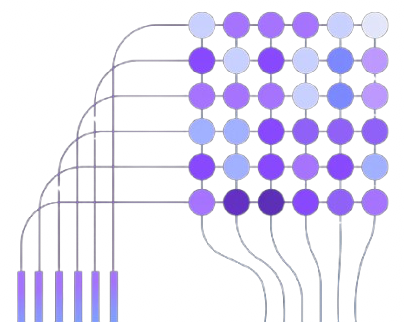

 
 

  

<h1 align="center">
    <a href="https://github.com/Piero24/decoder-is-all-you-need">Decoder Is All You Need</a>
</h1>

    
    
    <!-- -->
    
    
    

    This project implements the decoder part of the "Attention is All You Need" architecture, following Andrej Karpathy's video explanation.
     
    
     
     
    <a href="https://raw.githubusercontent.com/karpathy/char-rnn/master/data/tinyshakespeare/input.txt">Dataset</a>
    •
    <a href="https://arxiv.org/abs/1706.03762">Paper</a>
    •
    <a href="https://www.youtube.com/watch?v=kCc8FmEb1nY&ab_channel=AndrejKarpathy">Karpathy's video</a>

 

---

  
<h2 id="introduction">📔  Introduction</h2>

    This project provides a step-by-step implementation of the decoder component from the "Attention is All You Need" transformer architecture, guided by Andrej Karpathy's insightful video. The goal is to offer a clear and accessible understanding of how transformers work by building the decoder from scratch.

 

    

 

**Key Features:**

* **Educational Focus:** Designed to help learners grasp the intricacies of transformers through a hands-on approach.
* **Step-by-Step Implementation:** Mirrors the structure and explanations in Karpathy's video, making it easy to follow along.
* **Decoder-Centric:** Focuses specifically on the decoder component, which is crucial for understanding sequence generation tasks.
* **From-Scratch Approach:** Emphasizes building the model without relying on high-level libraries, promoting a deeper understanding of the underlying mechanisms.

---

<h3 id="responsible-disclosure"> 📮  Responsible Disclosure</h3>

    We assume no responsibility for an improper use of this code and everything related to it. We do not assume any responsibility for damage caused to people and / or objects in the use of the code.

<strong>
    By using this code even in a small part, the developers are declined from any responsibility.
</strong>
 
 

<a href="#top">⇧</a>

  
 --- 

<h3 id="third-party-licenses"> 📌  Third Party Licenses</h3>

In the event that the software uses third-party components for its operation, 
 
the individual licenses are indicated in the following section.
 
 
<strong>Software list:</strong>
 
<table>
  <tr  align="center">
    <th>Software</th>
    <th>License owner</th> 
    <th>License type</th> 
    <th>Link</th>
  </tr>
  <tr  align="center">
    <td>pyTorch</td>
    <td><a href="https://pytorch.org">PyTorch</a></td>
    <td>Multiple</td>
    <td><a href="https://github.com/pytorch/pytorch">here</a></td>
  </tr>
</table>

<a href="#top">⇧</a>

---
> *
 Copyrright (C) by Pietrobon Andrea   Released date: 15-09-2024*
